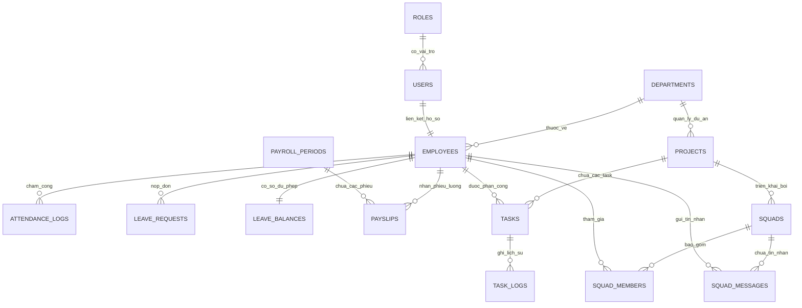

# TÀI LIỆU ĐẶC TẢ KIẾN TRÚC TOÀN DIỆN VÀ HƯỚNG DẪN TRIỂN KHAI HỆ THỐNG HRMS
## DỰ ÁN: NEXUS HR / FwB - HỆ THỐNG QUẢN TRỊ NHÂN SỰ TOÀN DIỆN TÍCH HỢP AI

> **Dành cho:** AI Coding Assistants, Tech Lead, Backend Developers, Database Architects.  
> **Phiên bản tài liệu:** v2.0 - Cập nhật đồng bộ toàn bộ Frontend và Phân cấp vai trò ngày 14/09/2026.  
> **Đơn vị thực hiện:** Nhóm 2 FwB (Lớp 23DTHB7 / 23DTHC3 - Khoa CNTT, Đại học HUTECH).  
> **Mục tiêu tài liệu:** Cung cấp bức tranh kỹ thuật toàn cảnh 100% về hiện trạng Frontend đã xây dựng, ma trận phân quyền người dùng (RBAC), đặc tả chi tiết kiến trúc Backend API cần triển khai, thiết kế Cơ sở dữ liệu chuẩn hóa (PostgreSQL ERD) và lộ trình ghép nối hệ thống. Bất kỳ AI hoặc lập trình viên nào khi đọc file này đều có thể nắm bắt trọn vẹn và tiếp tục phát triển hệ thống mà không bị sai lệch cấu trúc.

---

## MỤC LỤC
1. [TỔNG QUAN ĐỀ TÀI VÀ BÀI TOÁN KINH DOANH](#1-tổng-quan-đề-tài-và-bài-toán-kinh-doanh)
2. [CẤU TRÚC THƯ MỤC SOURCE CODE FRONTEND HIỆN TẠI](#2-cấu-trúc-thư-mục-source-code-frontend-hiện-tại)
3. [CHI TIẾT TOÀN BỘ CÁC TRANG GIAO DIỆN FRONTEND ĐÃ HOÀN THIỆN](#3-chi-tiết-toàn-bộ-các-trang-giao-diện-frontend-đã-hoàn-thiện)
4. [MA TRẬN PHÂN QUYỀN VÀ TRẢI NGHIỆM THEO VAI TRÒ (RBAC)](#4-ma-trận-phân-quyền-và-trải-nghiệm-theo-vai-trò-rbac)
5. [PHÂN TÍCH VÀ ĐẶC TẢ CHI TIẾT KIẾN TRÚC BACKEND (FASTAPI / NESTJS)](#5-phân-tích-và-đặc-tả-chi-tiết-kiến-trúc-backend-fastapi--nestjs)
6. [THIẾT KẾ CƠ SỞ DỮ LIỆU CHUẨN HÓA (POSTGRESQL DATABASE & ERD)](#6-thiết-kế-cơ-sở-dữ-liệu-chuẩn-hóa-postgresql-database--erd)
7. [HỆ THỐNG THỜI GIAN THỰC (WEBSOCKET CHAT & NOTIFICATIONS)](#7-hệ-thống-thời-gian-thực-websocket-chat--notifications)
8. [PHÂN HỆ TRÍ TUỆ NHÂN TẠO (AI ENGINE & ANALYTICS)](#8-phân-hệ-trí-tuệ-nhân-tạo-ai-engine--analytics)
9. [LỘ TRÌNH TRIỂN KHAI VÀ HƯỚNG DẪN PROMPTING DÀNH CHO AI](#9-lộ-trình-triển-khai-và-hướng-dẫn-prompting-dành-cho-ai)

---

## 1. TỔNG QUAN ĐỀ TÀI VÀ BÀI TOÁN KINH DOANH

### 1.1. Bối cảnh và Tính cấp thiết
Tại các doanh nghiệp quy mô vừa và lớn, công tác nhân sự thường bị phân mảnh nghiêm trọng:
- Hồ sơ nhân sự quản lý rải rác trên file Excel hoặc giấy tờ truyền thống.
- Chấm công phụ thuộc máy vân tay cổ điển, dễ ùn tắc và khó kiểm soát ca làm linh hoạt, làm thêm giờ (OT).
- Quy trình xin nghỉ phép thủ công, giấy tờ phê duyệt rườm rà qua nhiều cấp mất từ 2-4 ngày.
- Tính toán lương cuối tháng là "cơn ác mộng" đối với bộ phận C&B do phải đối soát thủ công hàng ngàn dòng công, phép, phụ cấp, giảm trừ gia cảnh, đóng bảo hiểm (BHXH, BHYT, BHTN) và tính thuế TNCN bậc thang lũy tiến.
- Đánh giá hiệu suất nhân viên mang tính cảm tính, thiếu dữ liệu thực chứng và không cảnh báo sớm được nguy cơ quá tải (Burnout) hay xu hướng nhân tài rời bỏ doanh nghiệp (Attrition Risk).

### 1.2. Giải pháp NEXUS HR (FwB HRMS)
Hệ thống **NEXUS HR** được định vị là nền tảng quản trị nguồn nhân lực hợp nhất (All-in-One Enterprise HR Platform) kết hợp phân hệ Quản lý Dự án nội bộ (Agile Project & Task Management) và Trợ lý Trí tuệ nhân tạo (AI Analytics). Hệ thống số hóa toàn diện vòng đời nhân sự (Employee Lifecycle):
1. **Tuyển dụng & Hồ sơ (Onboarding & Profile Management)**.
2. **Chấm công thông minh & Quản lý Ca làm (Smart Attendance & GPS/Kiosk)**.
3. **Quản lý Nghỉ phép tự động đa cấp (Multi-level Leave Approval)**.
4. **Động cơ Tính lương tự động theo Luật Lao Động Việt Nam (Payroll Engine)**.
5. **Dự án, Phân công nhiệm vụ & Đội nhóm dự án (Projects, Tasks, Squads & Real-time Chat)**.
6. **Đánh giá hiệu suất & Trí tuệ nhân tạo (AI Predictive Analytics & 9-Box Matrix)**.

---

## 2. CẤU TRÚC THƯ MỤC SOURCE CODE FRONTEND HIỆN TẠI

Source code Frontend được đặt tại thư mục `FrontEnd/` với cấu trúc chuẩn module hóa React + Vite + TailwindCSS:

```text
FrontEnd/
├── package.json                   # Cấu hình dependencies (React 18, Lucide-react, Framer-motion, TailwindCSS, Canvas-confetti)
├── vite.config.js                 # Cấu hình Vite dev server (Port 3000, alias)
├── tailwind.config.js             # Cấu hình bảng màu HSL, Apple Glass tokens, font Inter & Plus Jakarta Sans
├── index.html                     # File HTML chính, cấu hình viewport, title NEXUS HR
└── src/
    ├── App.jsx                    # Root component, cấu hình React Router, AuthProvider, ModalProvider
    ├── main.jsx                   # Entry point ReactDOM
    ├── index.css                  # Toàn bộ CSS Utilities, Glassmorphism, scrollbars, print styles
    ├── components/
    │   ├── common/                # Component dùng chung (Avatar, Badge, Button, Input, Card)
    │   └── layout/                # Layout khung:
    │       ├── Header.jsx         # Header thanh điều hướng trên cùng, Role Switcher mô phỏng, Chuông thông báo
    │       ├── Sidebar.jsx        # Thanh Sidebar điều hướng bên trái phân quyền động, nút Đăng xuất
    │       └── MainLayout.jsx     # Khung bố cục kết hợp Header + Sidebar + Content Viewport
    ├── context/
    │   ├── AuthContext.jsx        # Quản lý State phiên đăng nhập, Current Role (CEO, HRD, Manager, Employee)
    │   └── ModalContext.jsx       # Quản lý trạng thái đóng/mở tất cả các Modal trong toàn ứng dụng
    ├── data/                      # Mock Data chuyên sâu (mô phỏng nghiệp vụ thực tế)
    │   ├── mockAttendance.js      # Dữ liệu chấm công, GPS, ca làm việc, giải trình công
    │   ├── mockEmployees.js       # 348 hồ sơ nhân sự công ty, 20 nhân sự bộ phận Kỹ thuật
    │   ├── mockLeaves.js          # Dữ liệu đơn nghỉ phép, quỹ phép năm, phân loại nghỉ phép
    │   ├── mockPayroll.js         # Dữ liệu bảng lương công ty, phiếu lương chi tiết từng nhân viên
    │   ├── mockProjectsTasks.js   # Dữ liệu 4 dự án chiến lược, 12 task sprint, 3 Squads & tin nhắn chat
    │   └── mockRecruitment.js     # Dữ liệu ứng viên, pipeline tuyển dụng, lịch phỏng vấn
    ├── modals/                    # Toàn bộ các cửa sổ Modal popups theo từng trang
    │   ├── ModalContainer.jsx     # Trình quản lý render modal tập trung theo modalKey
    │   ├── common/                # Modal thông báo, xác nhận, đổi mật khẩu
    │   ├── page2/                 # Modals Dashboard (Bộ lọc chi tiết, Xuất báo cáo quản trị)
    │   ├── page3/                 # Modals Cổng nhân viên:
    │   │   ├── Modal3A_OtRegister.jsx      # Đăng ký làm thêm giờ (OT)
    │   │   ├── Modal3B_NoticeDetail.jsx    # Chi tiết thông báo nội bộ
    │   │   ├── Modal3C_PayslipPdf.jsx      # Xem và tải phiếu lương cá nhân PDF
    │   │   └── Modal3D_Handbook.jsx        # Sổ tay quy chế & văn hóa doanh nghiệp
    │   ├── page4/                 # Modals Hồ sơ nhân sự (Thêm nhân viên mới, Sửa hồ sơ, Quản lý phòng ban)
    │   ├── page5/                 # Modals Chấm công (Giải trình công, Đăng ký đổi ca)
    │   ├── page6/                 # Modals Nghỉ phép:
    │   │   ├── Modal6A_LeaveCalendar.jsx   # Lịch nghỉ phép bộ phận (Lịch tháng & Danh sách - Đã bỏ Gantt)
    │   │   └── Modal6B_LeaveRequest.jsx    # Tạo đơn xin nghỉ phép mới kèm tệp đính kèm
    │   ├── page7/                 # Modals Bảng lương (Chốt bảng lương tháng, Gửi phiếu lương hàng loạt)
    │   └── page8/                 # Modals AI Analytics (Chi tiết dự báo nghỉ việc, Kế hoạch đào tạo)
    └── pages/                     # 11 Trang giao diện chính của hệ thống:
        ├── Page1_Login.jsx        # Trang 1: Đăng nhập xác thực, SSO, OTP, Quick Role Switcher
        ├── Page2_Dashboard.jsx    # Trang 2: Bảng điều khiển quản trị thông minh & Executive Analytics
        ├── Page3_EmployeePortal.jsx # Trang 3: Bàn làm việc của tôi (My Desk / Employee Portal)
        ├── Page4_Directory.jsx    # Trang 4: Hồ sơ nhân sự / Nhân sự bộ phận / Đội nhóm dự án & Chat
        ├── Page5_Attendance.jsx   # Trang 5: Chấm công và Ca làm việc (Kiosk, GPS, Báo cáo công)
        ├── Page6_LeaveManagement.jsx # Trang 6: Quản lý nghỉ phép (Quy trình duyệt 2 cấp, Quỹ phép)
        ├── Page7_Payroll.jsx      # Trang 7: Xử lý tiền lương và quyết toán thu nhập
        ├── Page8_AiAnalytics.jsx  # Trang 8: Trợ lý AI & Phân tích chuyên sâu (9-Box, Attrition)
        ├── Page9_ProjectsTasks.jsx # Trang 9: Dự án và Tiến độ công việc (CEO, HRD, Manager, Employee)
        ├── Page_KioskFullscreen.jsx # Chế độ Kiosk chấm công sảnh toàn màn hình
        └── Page_Settings.jsx      # Cài đặt hệ thống, Cấu hình chính sách công ty
```

---

## 3. CHI TIẾT TOÀN BỘ CÁC TRANG GIAO DIỆN FRONTEND ĐÃ HOÀN THIỆN

Hệ thống Frontend đã được xây dựng hoàn thiện 100% giao diện với độ thẩm mỹ cao cấp (Apple Glassmorphism, chuẩn sáng Light Mode, typography tinh tế, không còn ký hiệu `&` mà sử dụng chữ `và` thuần Việt):

### 3.1. Trang 1: Đăng Nhập & Xác Thực Đa Nhân Tố (`Page1_Login.jsx`)
- **Chức năng**: Đăng nhập bằng Email/Mã nhân viên và Mật khẩu. Hỗ trợ xác thực 2 bước (OTP qua Email/SMS) và Đăng nhập một chạm SSO (Google Workspace, Microsoft 365).
- **Phân vai trò chuyển đổi nhanh (Dev / Demo Mode)**: Thanh công cụ cho phép chuyển đổi tức thì giữa 4 vai trò:
  - `CEO` - Tạ Văn Định (Tổng Giám Đốc)
  - `HR_DIRECTOR` - Trần Thu Hà (Giám Đốc Nhân Sự)
  - `LINE_MANAGER` - Vũ Đình Khang (Trưởng Phòng Kỹ Thuật Phần Mềm)
  - `EMPLOYEE` - Phạm Minh Quân (Kỹ Sư Phần Mềm Frontend)
- **Shortcut Kiosk**: Nút chuyển nhanh vào Chế độ Chấm công sảnh văn phòng.

### 3.2. Trang 2: Bảng Điều Khiển Quản Trị Thông Minh (`Page2_Dashboard.jsx`)
- **Dành cho**: Ban Giám Đốc (CEO) và Giám Đốc Nhân Sự (HRD).
- **Chức năng**:
  - Thẻ chỉ số điều hành vĩ mô (Executive KPIs): Tổng nhân sự (348), Tỷ lệ chuyên cần (98.4%), Chi phí quỹ lương thực tế vs Dự toán ngân sách, Tỷ lệ thôi việc tự nguyện (Turnover rate: 2.1%).
  - Biểu đồ phân tích cơ cấu nhân sự theo phòng ban, độ tuổi, trình độ học vấn.
  - Cảnh báo hợp đồng lao động sắp hết hạn trong 30-60 ngày cần gia hạn hoặc thanh lý.
  - Heatmap biến động lương và chi phí làm thêm giờ (OT) giữa các khối kinh doanh.

### 3.3. Trang 3: Bàn Làm Việc Của Tôi / Cổng Dịch Vụ Nhân Viên (`Page3_EmployeePortal.jsx`)
- **Dành cho**: Tất cả Cán bộ Nhân viên (Giao diện ESS - Employee Self-Service).
- **Chức năng**:
  - **Khung thông tin cá nhân**: Họ tên, Mã NV, Chức danh, Phòng ban, Nút mở Hồ sơ nhân sự chi tiết và Đăng xuất.
  - **Lịch làm việc và chuyên cần Tháng 9/2026**: Lưới lịch trực quan cả tháng với hệ thống 5 mã màu chuẩn nghiệp vụ:
    - `Xanh lá cây`: Đã đi làm và chấm công đủ giờ chuẩn mực.
    - `Xanh dương nhạt`: Ngày làm việc hiện tại, đã check-in thành công.
    - `Vàng cam nhạt`: Đi muộn hoặc về sớm có giải trình.
    - `Tím pastel`: Nghỉ phép năm / nghỉ việc riêng có phê duyệt hợp lệ.
    - `Xám nhạt`: Ngày nghỉ cuối tuần (Thứ 7, Chủ Nhật) hoặc Nghỉ lễ Quốc gia theo lịch Nhà nước.
    - Bảng giải thích mã màu rõ ràng ngay dưới lịch.
  - **Phím tắt tác vụ thiết yếu**: 2 phím tắt quan trọng nhất: *Đăng ký làm thêm (OT)* và *Quy chế và đãi ngộ*.
  - **Số dư ngày phép năm 2026**: Thống kê số ngày phép đã dùng (3.5 ngày), số ngày còn lại (8.5 ngày), quỹ phép thâm niên.
  - **Kế hoạch và Trọng tâm công việc hôm nay**: Tích hợp danh sách nhiệm vụ được bàn giao trực tiếp từ Trưởng phòng, liên kết đồng bộ sang Trang 9.

### 3.4. Trang 4: Hồ Sơ Nhân Sự / Nhân Sự Bộ Phận / Đồng Nghiệp & Đội Nhóm (`Page4_Directory.jsx`)
- **Chức năng phân cấp thích ứng cực kỳ thông minh**:
  - **Nếu là CEO hoặc HRD**: Hiển thị danh bạ toàn bộ 348 nhân sự công ty, bộ lọc đa chiều (Phòng ban, Trạng thái thử việc/chính thức), chức năng Thêm mới, Sửa, Xuất Excel, Quản trị cơ cấu tổ chức phòng ban.
  - **Nếu là Trưởng phòng (Line Manager)**:
    - **Tab 1: Danh sách nhân sự bộ phận (20 nhân sự)**: Chỉ hiển thị các kỹ sư trực thuộc phòng Kỹ thuật Phần mềm dưới quyền. Không thấy lương và số CCCD nhạy cảm.
    - **Tab 2: Đội nhóm dự án và Kênh trao đổi (3 Squads)**: Hiển thị các Squad dự án (`Squad Core Banking`, `Squad Mobile App`, `Squad Internal DevOps`), Techlead phụ trách, thành viên. Nút **`+ Tạo Đội Nhóm Dự Án Mới`** để chia đội và nút **`Mở Kênh Chat Đội Nhóm`** để chat trực tiếp.
  - **Nếu là Nhân viên (Employee)**:
    - **Tab 1: Đội nhóm dự án của tôi (My Squads - Mặc định)**: Chỉ hiển thị các dự án bản thân đang tham gia, vai trò của mình và đồng đội, số task đang chạy, và **Kênh Chat trao đổi trực tiếp với Trưởng phòng và thành viên nhóm**.
    - **Tab 2: Toàn bộ đồng nghiệp phòng Kỹ thuật (20 nhân sự)**: Tra cứu thông tin liên hệ công việc (Email, Số máy bàn, Vị trí ngồi) khi cần phối hợp liên nhóm. Toàn bộ thông tin bảo mật (CCCD, Lương, Hợp đồng) **bị ẩn tuyệt đối**.

### 3.5. Trang 5: Chấm Công Và Ca Làm Việc (`Page5_Attendance.jsx`)
- **Chức năng**:
  - Check-in / Check-out theo thời gian thực (hỗ trợ giả lập định vị GPS văn phòng).
  - Khai báo ca làm việc (Ca hành chính 8h00 - 17h30, Ca chiều, Ca trực kỹ thuật).
  - Bảng tổng hợp công tháng: Số ngày đi làm đủ, số lần đi muộn/về sớm, số giờ làm thêm (OT).
  - Form gửi **Giải trình chấm công** (quên quẹt thẻ, lỗi máy chấm công, công tác ngoài) gửi Trưởng phòng thẩm xét.

### 3.6. Trang 6: Quản Lý Nghỉ Phép (`Page6_LeaveManagement.jsx`)
- **Chức năng**:
  - **Quy trình phê duyệt 2 cấp chuẩn mực**:
    - Cấp 1: Trưởng phòng trực tiếp (Line Manager) xem xét lý do và ảnh hưởng tiến độ dự án ➔ Bấm duyệt.
    - Cấp 2: Giám Đốc Nhân Sự (HRD) hoặc Tổng Giám Đốc (CEO) phê duyệt chính thức ➔ Trừ tự động vào Quỹ phép.
  - **Nộp đơn nghỉ phép trực tuyến**: Hỗ trợ đầy đủ các loại phép (Phép năm, Nghỉ ốm đau có giấy BHXH, Nghỉ việc riêng kết hôn/tang chế, Nghỉ thai sản, Nghỉ không hưởng lương).
  - **Lịch nghỉ phép bộ phận (`Modal6A_LeaveCalendar.jsx`)**: Đã gỡ bỏ biểu đồ Gantt, cung cấp 2 chế độ xem trực quan:
    - `[ Lịch tháng ]`: Xem lưới ngày để biết ai nghỉ ngày nào, tránh xung đột lịch trực và thiếu hụt nhân sự dự án.
    - `[ Danh sách ]`: Tổng hợp tuần tự các đơn nghỉ phép kèm trạng thái chi tiết.

### 3.7. Trang 7: Xử Lý Tiền Lương Và Quyết Toán Thu Nhập (`Page7_Payroll.jsx`)
- **Chức năng phân cấp chuyên sâu**:
  - **Đối với HRD & CEO**:
    - Quản lý Bảng lương tổng thể doanh nghiệp kỳ Tháng 09/2026.
    - Động cơ phân bổ: Lương cơ bản theo hợp đồng, Lương ngày công thực tế, Tiền làm thêm giờ (150% ngày thường, 200% cuối tuần, 300% ngày lễ), Phụ cấp ăn trưa, phụ cấp trách nhiệm.
    - Trích đóng Bảo hiểm bắt buộc theo luật Việt Nam: BHXH (8%), BHYT (1.5%), BHTN (1%).
    - Tính Thuế TNCN lũy tiến từng phần (Giảm trừ bản thân 11.000.000 đ/tháng, Giảm trừ người phụ thuộc 4.400.000 đ/người/tháng).
    - Tính năng **Chốt bảng lương**, khóa sổ kế toán và Gửi phiếu lương điện tử qua Email hàng loạt.
  - **Đối với Nhân viên & Trưởng phòng**:
    - Chỉ xem được **Phiếu lương cá nhân bảo mật** của chính mình.
    - Tuyệt đối không thể xem bảng lương tổng thể hay mức thu nhập của đồng nghiệp.

### 3.8. Trang 8: Trợ Lý AI & Phân Tích Chuyên Sâu (`Page8_AiAnalytics.jsx`)
- **Chức năng**:
  - **Dự báo nguy cơ thôi việc (Attrition Risk Model)**: AI chấm điểm rủi ro nghỉ việc dựa trên tần suất đi muộn, số ngày nghỉ phép đột xuất, số giờ OT tăng cao và kết quả đánh giá KPI gần nhất.
  - **Ma trận 9-Box (Năng lực vs Tiềm năng)**: Tự động xếp loại nhân sự vào 9 nhóm (Top Talent, Core Performer, High Potential, Under Performer, v.v.).
  - **Gợi ý kế hoạch đào tạo & Lộ trình phát triển sự nghiệp cá nhân hóa**.

### 3.9. Trang 9: Dự Án Và Tiến Độ Công Việc (`Page9_ProjectsTasks.jsx`)
- **Chức năng thích ứng 4 vai trò (Giao diện Light Mode đẳng cấp)**:
  - **CEO (Cấp 1)**: Bàn điều hành danh mục dự án toàn doanh nghiệp, biểu đồ tiêu hao 861/1.360 giờ công ngân sách, cảnh báo dự án trễ hạn (At-Risk), xuất Báo cáo HĐQT (.PDF), phê duyệt khởi động dự án mới.
  - **HRD (Cấp 2A)**: Giám sát phân bổ nguồn lực lao động, phát hiện quá tải (Burnout Alert), đồng bộ kết quả hoàn thành task sang Điểm Đánh Giá KPI 9-Box.
  - **Trưởng phòng (Cấp 2B)**: Khởi tạo dự án bộ phận, phân rã task chi tiết gán cho nhân viên (kèm Deadline, Trọng số KPI, Giờ ước tính). Bảng **Kanban 4 cột** (*Chờ làm, Đang xử lý, Chờ kiểm duyệt, Hoàn thành*). **Thẩm duyệt nghiệm thu kết quả bàn giao** (Phê duyệt đạt yêu cầu hoặc Yêu cầu bổ sung chỉnh sửa).
  - **Nhân viên (Cấp 3)**: Không gian làm việc cá nhân (*Nhiệm vụ của tôi*). Thanh trượt cập nhật tiến độ công việc (0% ➔ 100%), chuyển trạng thái sang Chờ kiểm duyệt, **Nộp bàn giao kết quả** (đính kèm link Pull Request GitHub, tài liệu thiết kế Figma, ghi chú nghiệm thu).

---

## 4. MA TRẬN PHÂN QUYỀN VÀ TRẢI NGHIỆM THEO VAI TRÒ (RBAC)

Hệ thống thiết lập Ma trận Phân quyền truy cập theo vai trò (Role-Based Access Control - RBAC) nghiêm ngặt nhằm bảo đảm tuân thủ an toàn dữ liệu doanh nghiệp và Nghị định 13/2023/NĐ-CP về Bảo vệ dữ liệu cá nhân:

| Chức Năng / Phân Hệ | Cấp 1: CEO | Cấp 2A: Giám Đốc Nhân Sự (HRD) | Cấp 2B: Trưởng Phòng (Line Manager) | Cấp 3: Nhân Viên (Employee) |
| :--- | :---: | :---: | :---: | :---: |
| **Bảng điều khiển quản trị (`/dashboard`)** | Toàn quyền xem KPIs vĩ mô toàn công ty | Toàn quyền xem và phân tích chuyên sâu HR | Ẩn (Redirect về My Desk) | Ẩn (Redirect về My Desk) |
| **Bàn làm việc cá nhân (`/my-desk`)** | Xem lịch & sự vụ cá nhân | Xem lịch & sự vụ cá nhân | Bàn làm việc Trưởng phòng & nhiệm vụ | Bàn làm việc cá nhân & chấm công nhanh |
| **Danh bạ hồ sơ nhân sự (`/directory`)** | Xem 348 hồ sơ công ty, cấu trúc tổ chức | Xem, thêm, sửa, xuất Excel 348 hồ sơ | Chỉ xem 20 hồ sơ phòng Kỹ thuật, quản lý Squads & Chat | Xem Đội nhóm dự án của mình (có Chat) + Danh bạ liên hệ phòng ban |
| **Xem mức lương cơ bản & CCCD của nhân sự** | Có quyền | Có quyền | **TUYỆT ĐỐI BỊ ẨN** (Bảo vệ riêng tư nhân viên) | **CHỈ XEM CỦA CHÍNH MÌNH** |
| **Chấm công & Ca làm (`/attendance`)** | Xem báo cáo chuyên cần toàn công ty | Quản lý ca làm, phê duyệt bảng công công ty | Duyệt giải trình công nhân viên phòng mình | Tự chấm công GPS, xem lịch sử, gửi giải trình |
| **Quản lý Nghỉ phép (`/leaves`)** | Phê duyệt cấp 2 (Quyết định tối cao) | Phê duyệt cấp 2 (HR Xác nhận & trừ phép) | Phê duyệt cấp 1 (Duyệt đơn nhân viên phòng) | Nộp đơn xin nghỉ, xem số dư quỹ phép năm |
| **Quản lý Tiền lương (`/payroll`)** | Xem tổng hợp quỹ lương, duyệt chi lương | Xử lý bảng lương, tính thuế, chốt lương | **CHỈ XEM PHIẾU LƯƠNG CỦA CHÍNH MÌNH** | **CHỈ XEM PHIẾU LƯƠNG CỦA CHÍNH MÌNH** |
| **Phân tích AI & 9-Box (`/analytics`)** | Xem dự báo chiến lược nhân sự | Xem chi tiết 9-box, rủi ro thôi việc | Chỉ xem phân tích năng suất phòng mình | Ẩn |
| **Dự án và Tiến độ (`/tasks`)** | Giám sát danh mục vĩ mô, ngân sách giờ công | Giám sát phân bổ nhân lực, quá tải, KPI | Tạo dự án, gán task, Kanban, thẩm duyệt | Xem task được giao, kéo % tiến độ, nộp bàn giao |
| **Đội nhóm dự án & Kênh Chat** | Xem danh mục Squads | Xem phân bổ Squads | Tạo Squad, chỉ định Techlead, chat với nhóm | Chat thảo luận với Trưởng phòng & thành viên Squad |

---

## 5. PHÂN TÍCH VÀ ĐẶC TẢ CHI TIẾT KIẾN TRÚC BACKEND (FASTAPI / NESTJS)

Để hệ thống vận hành bền vững, bảo mật và tương thích tối đa với Module AI phân tích dữ liệu, Backend được đề xuất phát triển bằng **Python FastAPI** (hoặc **TypeScript NestJS**):

### 5.1. Lý do chọn Python FastAPI cho Backend
1. **Hiệu năng cao vượt trội**: Dựa trên Starlette và Pydantic, xử lý bất đồng bộ Asynchronous (`async/await`) với tốc độ tiệm cận NodeJS và Go.
2. **Tương thích hoàn hảo với Module AI/Data Science**: Các thư viện phân tích dữ liệu, máy học hàng đầu thế giới (Scikit-Learn, Pandas, NumPy, PyTorch, LangChain) đều viết trên nền tảng Python, cho phép tích hợp trực tiếp Module AI phân tích nhân sự vào chung một codebase mà không cần tạo microservice phức tạp.
3. **Tự động sinh tài liệu Swagger UI OpenAPI**: Hỗ trợ tài liệu hóa API tự động tại `/docs`, cực kỳ thuận tiện cho đội ngũ Frontend và AI ghép nối.
4. **Xác thực dữ liệu chặt chẽ**: Pydantic tự động validate kiểu dữ liệu đầu vào, ngăn ngừa lỗi runtime và SQL Injection.

### 5.2. Cấu trúc thư mục Backend chuẩn (Python FastAPI)
```text
backend/
├── app/
│   ├── main.py                  # Khởi tạo FastAPI app, cấu hình CORS, Router, Middleware
│   ├── core/                    # Cấu hình lõi hệ thống:
│   │   ├── config.py            # Biến môi trường (.env), database URL, JWT secret key
│   │   ├── security.py          # Hash mật khẩu (bcrypt), sinh JWT access/refresh token
│   │   └── rbac.py              # Middleware kiểm tra quyền hạn vai trò (Role Checker)
│   ├── db/                      # Kết nối cơ sở dữ liệu:
│   │   ├── session.py           # SQLAlchemy Engine, SessionLocal, AsyncSession
│   │   └── base.py              # Import toàn bộ Models phục vụ Alembic Migrations
│   ├── models/                  # SQLAlchemy ORM Models (Tương ứng bảng CSDL)
│   ├── schemas/                 # Pydantic Schemas (DTO - Request / Response Validation)
│   ├── api/                     # Các Endpoint định tuyến RESTful API:
│   │   ├── v1/
│   │   │   ├── auth.py          # /api/v1/auth (Đăng nhập, OTP, Refresh Token)
│   │   │   ├── employees.py     # /api/v1/employees (Hồ sơ nhân sự)
│   │   │   ├── attendance.py    # /api/v1/attendance (Chấm công, GPS, Giải trình)
│   │   │   ├── leaves.py        # /api/v1/leaves (Nghỉ phép, Duyệt đơn 2 cấp)
│   │   │   ├── payroll.py       # /api/v1/payroll (Tính lương, BHXH, Thuế TNCN, Phiếu lương)
│   │   │   ├── projects.py      # /api/v1/projects (Dự án & Quản trị danh mục)
│   │   │   ├── tasks.py         # /api/v1/tasks (Kanban, Gán việc, Cập nhật %, Nghiệm thu)
│   │   │   ├── squads.py        # /api/v1/squads (Đội nhóm dự án, Kênh chat WebSocket)
│   │   │   └── ai_analytics.py  # /api/v1/ai (Phân tích hiệu suất, Dự báo thôi việc, 9-Box)
│   │   └── deps.py              # Dependencies: get_db, get_current_user, require_role
│   ├── services/                # Nghiệp vụ kinh doanh (Business Logic Services):
│   │   ├── payroll_engine.py    # Thuật toán tính lương, lũy tiến thuế, bảo hiểm
│   │   ├── leave_engine.py      # Thuật toán tính trừ phép, cộng dồn phép thâm niên
│   │   └── ai_engine.py         # Huấn luyện model, dự báo chỉ số hiệu suất
│   └── websocket/               # Trình quản lý Socket thời gian thực (Chat & Notifications)
│       └── connection_manager.py
├── alembic/                     # Quản lý Database Migration phiên bản CSDL
├── tests/                       # Unit Test & Integration Test (PyTest)
├── Dockerfile                   # Đóng gói ứng dụng container
├── docker-compose.yml           # Khởi tạo FastAPI + PostgreSQL 16 + Redis Cache
└── requirements.txt             # Danh sách thư viện Python
```

### 5.3. Danh sách RESTful API Cốt Lõi Cần Triển Khai
```text
# 1. Phân hệ Xác thực & Tài khoản
POST   /api/v1/auth/login                  # Đăng nhập nhận JWT Token & Thông tin vai trò
POST   /api/v1/auth/refresh-token          # Làm mới Access Token
POST   /api/v1/auth/logout                 # Đăng xuất thu hồi token
GET    /api/v1/auth/me                     # Lấy thông tin tài khoản đang đăng nhập

# 2. Phân hệ Hồ sơ Nhân sự
GET    /api/v1/employees                   # Danh sách nhân sự (Lọc theo phòng ban, phân trang)
GET    /api/v1/employees/{id}              # Chi tiết hồ sơ (Tự động ẩn lương/CCCD nếu không đủ quyền)
POST   /api/v1/employees                   # Thêm nhân viên mới (Chỉ HRD / CEO)
PUT    /api/v1/employees/{id}              # Cập nhật hồ sơ nhân sự
DELETE /api/v1/employees/{id}              # Xóa/chuyển trạng thái nhân sự nghỉ việc

# 3. Phân hệ Chấm công & Ca làm
POST   /api/v1/attendance/check-in         # Ghi nhận giờ Check-in kèm tọa độ GPS
POST   /api/v1/attendance/check-out        # Ghi nhận giờ Check-out
GET    /api/v1/attendance/my-monthly       # Lịch sử chấm công cá nhân trong tháng
GET    /api/v1/attendance/department-summary # Báo cáo chuyên cần phòng ban (Trưởng phòng)
POST   /api/v1/attendance/appeals          # Gửi đơn giải trình chấm công
PUT    /api/v1/attendance/appeals/{id}/review # Trưởng phòng duyệt/từ chối giải trình

# 4. Phân hệ Quản lý Nghỉ phép
GET    /api/v1/leaves/balances/me          # Xem số dư ngày phép năm của bản thân
POST   /api/v1/leaves/requests             # Nộp đơn xin nghỉ phép mới
GET    /api/v1/leaves/pending              # Danh sách đơn chờ duyệt theo cấp bậc
PUT    /api/v1/leaves/requests/{id}/manager-approve # Cấp 1: Trưởng phòng duyệt
PUT    /api/v1/leaves/requests/{id}/hr-approve      # Cấp 2: HRD phê duyệt chính thức
GET    /api/v1/leaves/department-calendar  # Lịch nghỉ phép phòng ban (Lưới tháng & Danh sách)

# 5. Phân hệ Tính lương & Thuế (Payroll Engine)
POST   /api/v1/payroll/calculate-monthly   # Động cơ tự động tính toán bảng lương tháng
GET    /api/v1/payroll/company-sheet       # Bảng lương toàn công ty (Chỉ HRD & CEO)
GET    /api/v1/payroll/payslips/me         # Phiếu lương cá nhân bảo mật (Nhân viên)
POST   /api/v1/payroll/lock-month          # Chốt bảng lương và sinh tệp PDF/Excel gửi mail

# 6. Phân hệ Dự án, Phân công nhiệm vụ & Squads
GET    /api/v1/projects                    # Danh sách dự án (CEO xem hết, Manager xem phòng ban)
POST   /api/v1/projects                    # Khởi tạo dự án mới
GET    /api/v1/tasks                       # Lấy danh sách nhiệm vụ (Lọc theo project, stage, assignee)
POST   /api/v1/tasks                       # Trưởng phòng gán task cho nhân viên
PUT    /api/v1/tasks/{id}/progress         # Nhân viên cập nhật % tiến độ & nộp nghiệm thu
PUT    /api/v1/tasks/{id}/review           # Trưởng phòng thẩm duyệt (Đạt / Yêu cầu làm lại)
GET    /api/v1/squads                      # Danh sách Đội nhóm dự án
POST   /api/v1/squads                      # Trưởng phòng tạo Squad mới
GET    /api/v1/squads/{id}/messages        # Lấy lịch sử tin nhắn trong Kênh Chat Squad
WS     /ws/squads/{id}/chat                # WebSocket kết nối chat thời gian thực
```

---

## 6. THIẾT KẾ CƠ SỞ DỮ LIỆU CHUẨN HÓA (POSTGRESQL DATABASE & ERD)

Cơ sở dữ liệu được thiết kế theo chuẩn 3NF (Third Normal Form) trên nền tảng **PostgreSQL 16** bảo đảm tính toàn vẹn dữ liệu, hiệu năng cao và bảo mật nhiều lớp.

### 6.1. Sơ đồ Quan hệ Thực thể (Mermaid ERD)


### 6.2. Chi tiết Cấu trúc các Bảng CSDL Cốt Lõi

#### Bảng `departments` (Phòng ban)
- `id` (VARCHAR(20), PK): Mã phòng ban (e.g., `DEPT-IT`, `DEPT-HR`, `DEPT-ACC`).
- `name` (VARCHAR(100), NOT NULL): Tên phòng ban.
- `manager_id` (VARCHAR(20)): Mã nhân viên làm Trưởng phòng (FK liên kết `employees.id`).
- `budget_yearly` (NUMERIC(15, 2)): Ngân sách hoạt động năm.
- `created_at` (TIMESTAMP WITH TIME ZONE, DEFAULT NOW()).

#### Bảng `users` (Tài khoản người dùng & Xác thực)
- `id` (UUID, PK, DEFAULT gen_random_uuid()): ID định danh duy nhất.
- `employee_id` (VARCHAR(20), UNIQUE, FK `employees.id`): Mã nhân viên liên kết.
- `email` (VARCHAR(100), UNIQUE, NOT NULL): Email đăng nhập hệ thống.
- `password_hash` (VARCHAR(255), NOT NULL): Mật khẩu băm chuẩn bcrypt.
- `role_code` (VARCHAR(20), NOT NULL): `CEO`, `HR_DIRECTOR`, `LINE_MANAGER`, `EMPLOYEE`, `ADMIN`.
- `is_active` (BOOLEAN, DEFAULT TRUE): Trạng thái tài khoản.
- `last_login_at` (TIMESTAMP WITH TIME ZONE): Thời gian đăng nhập gần nhất.

#### Bảng `employees` (Hồ sơ nhân sự chi tiết)
- `id` (VARCHAR(20), PK): Mã nhân viên (e.g., `NV-0842`).
- `full_name` (VARCHAR(100), NOT NULL): Họ và tên đầy đủ.
- `department_id` (VARCHAR(20), FK `departments.id`): Phòng ban trực thuộc.
- `job_title` (VARCHAR(100), NOT NULL): Chức danh công việc.
- `work_email` (VARCHAR(100), NOT NULL): Email công vụ.
- `phone_number` (VARCHAR(20)): Số điện thoại.
- `citizen_id` (VARCHAR(20), NOT NULL): Số Căn cước công dân (Dữ liệu nhạy cảm, mã hóa).
- `base_salary` (NUMERIC(12, 2), NOT NULL): Mức lương cơ bản theo hợp đồng (Bảo mật).
- `contract_type` (VARCHAR(50)): `CHINH_THUC`, `THU_VIEC`, `THOI_VU`.
- `joined_date` (DATE, NOT NULL): Ngày gia nhập công ty.
- `avatar_url` (TEXT): Đường dẫn ảnh đại diện.
- `status` (VARCHAR(20), DEFAULT 'DANG_LAM_VIEC'): `DANG_LAM_VIEC`, `TAM_HOAN`, `DA_NGHI_VIEC`.

#### Bảng `attendance_logs` (Nhật ký chấm công)
- `id` (BIGSERIAL, PK): Mã giao dịch chấm công.
- `employee_id` (VARCHAR(20), FK `employees.id`, NOT NULL): Mã nhân sự.
- `work_date` (DATE, NOT NULL): Ngày làm việc.
- `check_in_time` (TIMESTAMP WITH TIME ZONE): Thời gian quẹt vào.
- `check_out_time` (TIMESTAMP WITH TIME ZONE): Thời gian quẹt ra.
- `status` (VARCHAR(30)): `DUNG_GIO`, `DI_MUON`, `VE_SOM`, `NGHI_PHEP`, `VANG_KHONG_PHEP`.
- `late_minutes` (INTEGER, DEFAULT 0): Số phút đi muộn.
- `ot_hours` (NUMERIC(4, 2), DEFAULT 0): Số giờ làm thêm (OT).
- `gps_lat` / `gps_lng` (NUMERIC(10, 6)): Tọa độ định vị GPS khi chấm công.

#### Bảng `leave_requests` (Đơn xin nghỉ phép)
- `id` (VARCHAR(30), PK): Mã đơn phép (e.g., `LP-2026-104`).
- `employee_id` (VARCHAR(20), FK `employees.id`, NOT NULL): Người nộp đơn.
- `leave_type` (VARCHAR(50), NOT NULL): `PHEP_NAM`, `NGHI_OM`, `VIEC_RIENG`, `THAI_SAN`, `KHONG_LUONG`.
- `start_date` (DATE, NOT NULL): Ngày bắt đầu nghỉ.
- `end_date` (DATE, NOT NULL): Ngày kết thúc nghỉ.
- `total_days` (NUMERIC(3, 1), NOT NULL): Tổng số ngày nghỉ xin phép.
- `reason` (TEXT, NOT NULL): Lý do nghỉ.
- `attachment_url` (TEXT): Giấy chứng nhận y tế/giấy tờ minh chứng.
- `stage` (VARCHAR(30), DEFAULT 'CHO_TRUONG_PHONG_DUYET'):
  - `CHO_TRUONG_PHONG_DUYET` ➔ `CHO_HR_PHE_CHUAN` ➔ `DA_PHE_DUYET` / `TU_CHOI`.
- `manager_note` (TEXT): Ghi chú phê duyệt của Trưởng phòng.
- `hr_note` (TEXT): Ghi chú phê chuẩn của Ban Nhân sự.

#### Bảng `payroll_periods` & `payslips` (Bảng lương & Phiếu lương cá nhân)
- `id` (BIGSERIAL, PK)
- `period_month_year` (VARCHAR(10)): Kỳ lương (e.g., `2026-09`).
- `base_salary` (NUMERIC(12, 2)): Lương thỏa thuận trên hợp đồng.
- `actual_work_days` (NUMERIC(4, 1)): Số ngày công thực tế đi làm.
- `ot_pay` (NUMERIC(12, 2)): Tiền lương làm thêm giờ (đã nhân hệ số).
- `gross_income` (NUMERIC(12, 2)): Tổng thu nhập trước thuế và bảo hiểm.
- `bhxh_amount` (NUMERIC(10, 2)): Trích đóng BHXH (8%).
- `bhyt_amount` (NUMERIC(10, 2)): Trích đóng BHYT (1.5%).
- `bhtn_amount` (NUMERIC(10, 2)): Trích đóng BHTN (1%).
- `pit_amount` (NUMERIC(12, 2)): Thuế Thu Nhập Cá Nhân sau giảm trừ gia cảnh.
- `net_salary` (NUMERIC(12, 2)): Tiền lương thực nhận về tài khoản ngân hàng.
- `status` (VARCHAR(20)): `DU_THAO`, `DA_CHOT`, `DA_CHUYEN_KHOAN`.

#### Bảng `projects` & `tasks` (Dự án & Phân công nhiệm vụ)
- `projects`: `id` (PK), `name`, `code`, `department_id`, `manager_id`, `budget_hours`, `used_hours`, `progress` (0-100), `status` (`planning`, `in_progress`, `completed`, `at_risk`).
- `tasks`: `id` (PK, e.g. `TSK-101`), `project_id` (FK), `title`, `description`, `assignee_id` (FK `employees.id`), `deadline`, `priority` (`Thấp`, `Trung bình`, `Cao`, `Khẩn cấp`), `kpi_weight` (1-100%), `progress` (0-100%), `stage` (`todo`, `in_progress`, `review`, `done`), `deliverable_url` (Link GitHub PR / Figma bàn giao), `deliverable_note`.
- `task_logs`: Lưu vết lịch sử chuyển trạng thái, ghi chú nghiệm thu của Trưởng phòng.

#### Bảng `squads`, `squad_members` & `squad_messages` (Đội nhóm dự án & Kênh Chat)
- `squads`: `id` (PK, e.g. `SQ-01`), `name`, `project_id` (FK), `lead_id` (FK `employees.id`), `target`.
- `squad_members`: `squad_id` (FK), `employee_id` (FK), `joined_at`.
- `squad_messages`: `id` (BIGSERIAL, PK), `squad_id` (FK), `sender_id` (FK `employees.id`), `content` (TEXT), `sent_at` (TIMESTAMP), `is_system_notice` (BOOLEAN).

---

## 7. HỆ THỐNG THỜI GIAN THỰC (WEBSOCKET CHAT & NOTIFICATIONS)

### 7.1. Giao thức Kênh Chat Đội Nhóm Dự Án
Khi người dùng mở Modal Chat Đội nhóm tại Trang 4 (`/directory`), Frontend kết nối tới WebSocket Server:
```text
ws://<api-domain>/ws/squads/{squad_id}/chat?token=<jwt_access_token>
```
- **Xác thực kết nối**: Server bóc tách JWT từ query params, xác minh xem user có thuộc `squad_members` của squad đó hoặc là Trưởng phòng bộ phận / Ban Giám Đốc hay không. Nếu không, ngắt kết nối với mã `4403 Forbidden`.
- **Payload gửi tin nhắn (Client ➔ Server)**:
  ```json
  {
    "action": "send_message",
    "text": "Đã hoàn thành merge Pull Request #48 cho module Chấm công Kiosk!"
  }
  ```
- **Payload phát sóng (Server ➔ All Squad Clients)**:
  ```json
  {
    "event": "new_message",
    "data": {
      "id": 1042,
      "squadId": "SQ-01",
      "senderId": "NV-0842",
      "senderName": "Phạm Minh Quân",
      "roleBadge": "Kỹ sư Frontend Lead",
      "avatar": "https://images.unsplash.com/...",
      "text": "Đã hoàn thành merge Pull Request #48 cho module Chấm công Kiosk!",
      "time": "14:35",
      "isManager": false
    }
  }
  ```

---

## 8. PHÂN HỆ TRÍ TUỆ NHÂN TẠO (AI ENGINE & ANALYTICS)

### 8.1. Thuật toán Dự Báo Nguy Cơ Thôi Việc (Employee Attrition Prediction)
- **Đầu vào (Features)**:
  - `overtime_hours_last_30d`: Số giờ làm thêm tháng gần nhất.
  - `late_frequency_ratio`: Tỷ lệ số ngày đi muộn trên tổng ngày công.
  - `unplanned_leaves_count`: Số ngày nghỉ phép đột xuất / nghỉ không lương.
  - `kpi_score_recent`: Điểm đánh giá năng suất chu kỳ gần nhất.
  - `tenure_months`: Thời gian gắn bó với doanh nghiệp.
  - `salary_growth_rate`: Tốc độ tăng lương so với mặt bằng chung.
- **Mô hình máy học**: Random Forest Classifier hoặc Gradient Boosting (XGBoost).
- **Đầu ra (Output)**: Xác suất nguy cơ nghỉ việc (0.00 ➔ 1.00) và Nhãn phân loại:
  - `Thấp` (< 20%): Trạng thái ổn định, gắn kết cao.
  - `Trung bình` (20% - 60%): Cần lắng nghe, điều chỉnh khối lượng công việc.
  - `Nguy cơ cao` (> 60%): Cảnh báo khẩn tới HRD và Trưởng phòng để có biện pháp can thiệp, phỏng vấn giữ chân nhân tài (Stay Interview).

### 8.2. Đánh Giá Năng Lực Ma Trận 9-Box Tự Động
- Trục X (Hiệu suất công việc - Performance): Tính toán tự động từ Tỷ lệ hoàn thành đúng hạn các Task trong Sprint tại Trang 9 (`Page9_ProjectsTasks.jsx`) kết hợp Đánh giá của Trưởng phòng.
- Trục Y (Tiềm năng phát triển - Potential): Tính toán dựa trên khả năng giải quyết các task có trọng số KPI cao, tính chủ động hỗ trợ đồng đội và kết quả các khóa đào tạo nội bộ.

---

## 9. LỘ TRÌNH TRIỂN KHAI VÀ HƯỚNG DẪN PROMPTING DÀNH CHO AI

Khi một AI mới được yêu cầu tiếp tục phát triển phần Backend hoặc hoàn thiện dự án này, hãy tuân theo các bước chỉ dẫn chiến lược sau:

### Bước 1: Khởi tạo Project Backend với Python FastAPI
- Chạy lệnh khởi tạo môi trường ảo Python: `python -m venv venv`
- Cài đặt các dependencies cốt lõi:
  `fastapi`, `uvicorn[standard]`, `sqlalchemy`, `alembic`, `pydantic[email]`, `python-jose[cryptography]`, `passlib[bcrypt]`, `asyncpg`, `psycopg2-binary`, `redis`, `websockets`, `scikit-learn`, `pandas`.

### Bước 2: Thiết lập Database Schema & Migrations
- Tạo database `nexus_hrms` trên PostgreSQL.
- Định nghĩa các file SQLAlchemy Models trong thư mục `app/models/` dựa theo đặc tả bảng ở **Mục 6** của tài liệu này.
- Chạy Alembic: `alembic revision --autogenerate -m "Init HRMS Database Schema"` và `alembic upgrade head`.
- Viết script `seed_data.py` nạp dữ liệu mẫu ban đầu đồng bộ hoàn toàn với các file mock trong `FrontEnd/src/data/` (`mockEmployees.js`, `mockProjectsTasks.js`, `mockLeaves.js`).

### Bước 3: Phát triển RESTful API & Cơ chế Bảo mật
- Viết Authentication Controller với JWT và Role-Checker Middleware kiểm tra 4 vai trò (`CEO`, `HR_DIRECTOR`, `LINE_MANAGER`, `EMPLOYEE`).
- Đảm bảo logic che giấu dữ liệu nhạy cảm (Field-level Security): Khi Trưởng phòng hoặc Nhân viên gọi API `GET /api/v1/employees/{id}`, Backend phải tự động loại bỏ 2 trường `base_salary` và `citizen_id` khỏi JSON response.

### Bước 4: Đấu nối Frontend với Backend (API Integration)
- Trong `FrontEnd/src/`, tạo thư mục `src/services/` chứa các tệp gọi API sử dụng `axios` hoặc `fetch`:
  - `authService.js`, `employeeService.js`, `attendanceService.js`, `leaveService.js`, `payrollService.js`, `projectService.js`.
- Cấu hình file `.env` ở Frontend: `VITE_API_BASE_URL=http://localhost:8000/api/v1`.
- Thay thế các `mockData` trong các trang React bằng các React Hooks (`useEffect`, `useQuery`) lấy dữ liệu động từ Backend API.

---
*Tài liệu được biên soạn công phu, chuẩn mực kỹ thuật và lưu hành nội bộ dự án NEXUS HR - FwB HRMS.*
